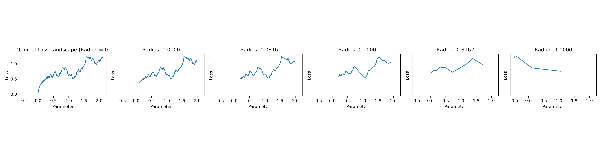
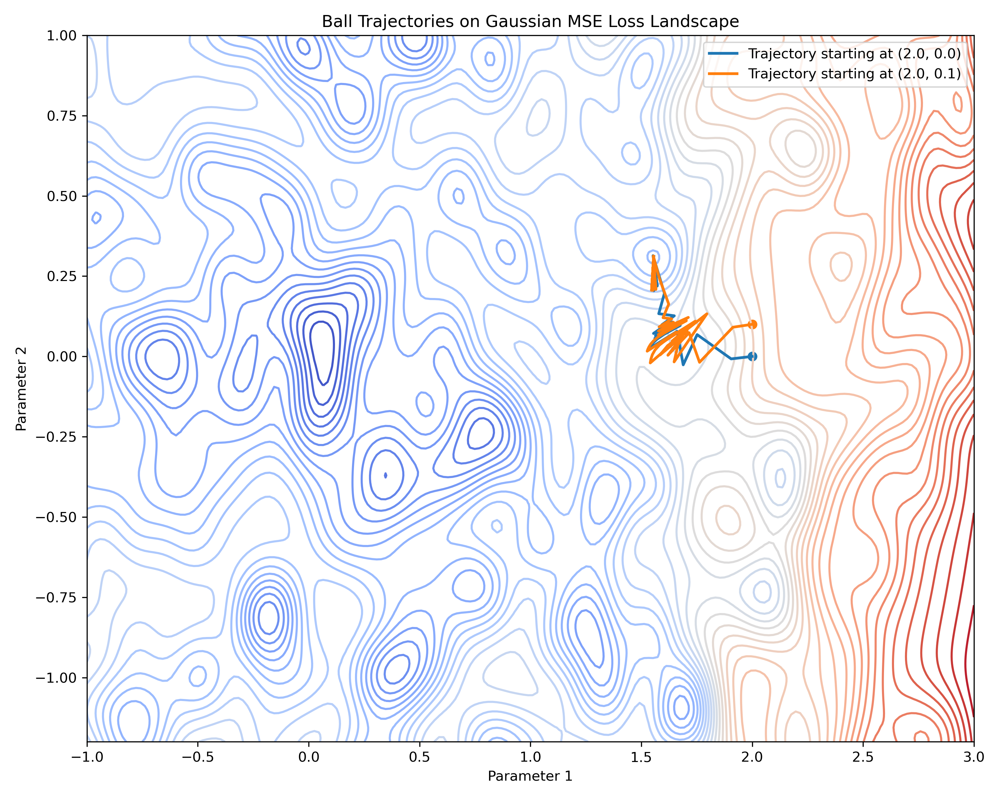

# The rolling ball optimizer

This repository contains the code for the rolling ball optimizer (RBO),
proposed in the paper [Navigating loss manifolds via rigid body dynamics: A promising avenue for robustness and generalisation](https://arxiv.org/pdf/2505.19527).
RBO tries to address the problem of strong local dependence in state of the art optimizers.
While standard optimizers like SGD and Adam behave like point-particles, RBO behaves like a ball with finite radius.


## Installation
>[!WARNING]
> The code is still under development, and in fact, is in the process of being refactored.
> As such, the API of the optimizers may change in the future, and the experiments may not run as expected (or at all).
> If you encounter any issues, please open an issue on the repository or contact the authors directly.

To install the package, run the following command:

```bash
git clone https://github.com/rbouadjenek/milestone-d1.2-followup.git
cd milestone-d1.2-followup
nix develop --impure # or cd src && pip install -e . if you don't have nix installed
```

After that, you will have access to the `utilities` package.
The relevant module is `utilities.optim`, which contains RBO implementations
used in the experiments.

## Usage examples

To evaluate the performance of RBO, we have used a number of loss functions.
In order to be able to control the difficulty of the optimization problem,
we have opted for closed-form loss functions, rather than neural networks.
The code for these loss functions is available at [this repository](https://github.com/mohammedbelgoumri/milestone-d-2.5), along with more details on their properties.

### Weirstrass-like loss function


The Weirstrass-like loss function is defined as:
```math
f_n(\theta) = \sum_{k=1}^{n} \frac{1}{k^2} \sin(k^2 \theta).
```
It is cahracterized by extreme gradients, and a large number of local minima.
As such it is very difficult to optimize using standard optimizers.
The graph of this function, as well as the effect of the rolling ball optimizer on it, is shown below. 
As can be seen, RBO "sees" the loss landscape as if it were smoother,
and effect that intensifies as the radius of the ball increases.
We refer to this effect as the "ironing property" of RBO in the paper.
The code to generate this figure is in the `examples/weirstrass.py` file.



The following code snippet shows how the code can be called to generate a plot:
```python
import matplotlib.pyplot as plt
import numpy as np

from examples.weirstrass import grad_fn, loss_fn
from utilities.optim import rolling_ball_trajectory

x = np.linspace(0, 2.1, 1000)
y = loss_fn(x)

fig, ax = plt.subplots(ncols=3, sharey=True, sharex=True)
ax[0].plot(x, y)
ax[0].set_title("Original Loss Landscape (Radius = 0)")
ax[0].set_xlabel("parameter")
ax[0].set_ylabel("loss")

params, centers = rolling_ball_trajectory(
    value_and_grad_fn=lambda x: (loss_fn(x), grad_fn(x)),
    lr=1e-3,
    initial=2.0,
    radius=0.03,
    n_epochs=2000,
    n_projections=20,
    projection_step=0.05,
)
ax[1].plot(centers[:, 0], centers[:, 1])
ax[1].set_title("Radius = 0.03")
```


### Gaussian MSE loss function

In addition to the ironing property, RBO also has an interesting effect on sensitivity to initialization.
While most traditional optimizers converge to completely different minima
when initialized at slightly different points, RBO (with an appropriate radius)
converges to the same, or a nearby minimum.

To demonstrate this effect, we have used the Gaussian MSE loss function (refer to [this repository](https://github.com/mohammedbelgoumri/milestone-d-2.5) for more details on this loss function).
It is characterized by a large number of local minima, densely packed together.
As such, traditional optimizers tend to be very sensitive to small perturbations in initialization.
The figure below shows the trajectory of the rolling ball optimizer 
with a radius of 2 from two initializations ($(2, 0)$ and $(2, 0.1)$).
Both initializations converge to the same point.
The code to generate this figure is in the `examples/gaussian.py` file.



The code for generating this figure (as well as the calling code for the Weirstrass-like loss function) is available in `notebook.ipynb`.


## How to cite

To cite this repository, use the following format:

```bibtex
@online{belgoumriDataQualityEdge2024,
  title = {Data {{Quality}} in {{Edge Machine Learning}}: {{A State-of-the-Art Survey}}},
  shorttitle = {Data {{Quality}} in {{Edge Machine Learning}}},
  author = {Belgoumri, Mohammed Djameleddine and Bouadjenek, Mohamed Reda and Aryal, Sunil and Hacid, Hakim},
  date = {2024-06-01},
  eprint = {2406.02600},
  eprinttype = {arXiv},
  eprintclass = {cs, stat},
  doi = {10.48550/arXiv.2406.02600},
  url = {http://arxiv.org/abs/2406.02600},
  urldate = {2024-06-18},
```

## Team members

- Mohammed Belgoumri (m.belgoumri@deakin.edu.au)
- Mohamed Reda Bouadjenek (reda.bouadjenek@deakin.edu.au)
- Hakim Hacid (hakim.hacid@tii.ae)
- Sunil Aryal (sunil.aryal@deakin.edu.au)
